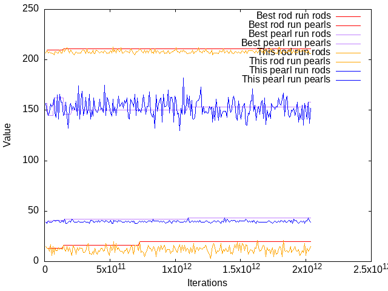

# SIMULATION AND SIMULACRA



A program that simulates "playing Minecraft", watching how many blaze rods drop
and how many ender pearls are traded for.

On a Ryzen 1600 processor, using 12 threads, this code takes about 1.29 seconds
to perform (the default value of) 200 simulation jobs, each performing
1,000,000 simulations. This results in performing about 156 million
simulations a second.

This program repeatedly prints out lines like

```
2.294e+09 iterations: (209 rods, 13) (151, 39 pearls)    this run: (209 rods, 13) (151, 39 pearls)
```

which report the best runs of the loop, and the best runs of the batch. We 
measure the "best" as:

- If we have not reached the primary target (211 rods for the blaze rod loot,
  and 42 pearl trades for the ender pearl trades), then maximize the primary
  value.
- If we aren't decreasing the primary value, maximize the secondary value.

You win if either run reaches at least `(212 rods, 42 pearls)`. One run must
achieve both values; it does not take too long to reach something like
`(212 rods, 10) (167, 42 pearls)`, but neither run is in fact successful.

On SBCL, you can make things a tiny bit faster with `(push :popcnt sb-c:*backend-subfeatures*)`,
assuming your CPU supports the `POPCNT` instruction.
